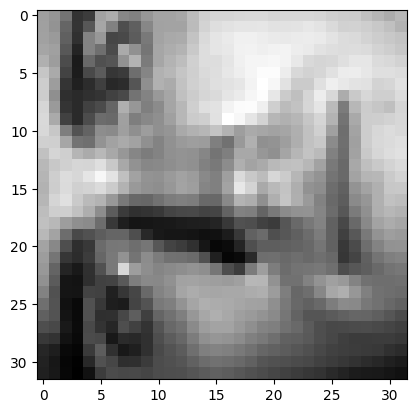
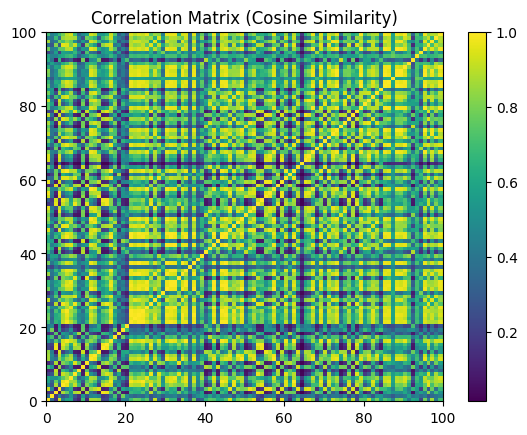
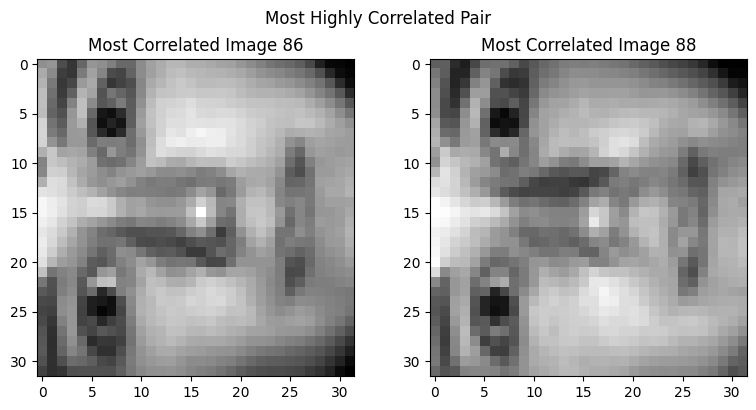
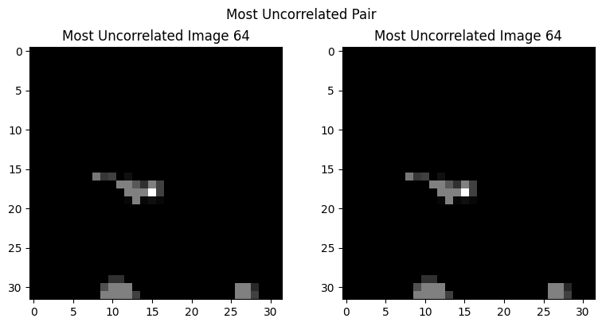
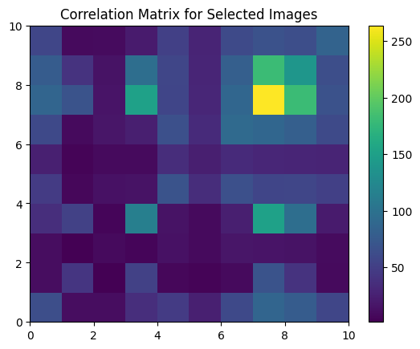
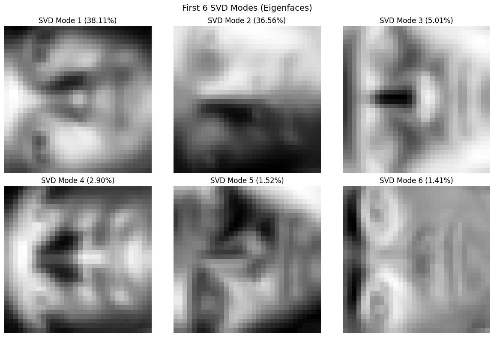

# Homework 3 Report — Feature Spaces

## Dataset

The **Yale Face Database** contains 2414 grayscale face images (39 subjects, ~65 lighting conditions each). Each image is downsampled to 32 x 32 pixels and flattened into a column vector of length 1024. The full data matrix $\mathbf{X}$ is therefore $1024 \times 2414$.

```python
from scipy.io import loadmat
results = loadmat('yalefaces.mat')
X = results['X']  # shape: (1024, 2414)
```

Here is a sample face from the dataset (image index 5):



---

## Part (a) — 100 x 100 Correlation Matrix

We compute the correlation (dot product) between the first 100 images. To make the values interpretable as **cosine similarity** (bounded in $[-1, 1]$), each image vector is first normalized to unit length:

$$\hat{\mathbf{x}}_j = \frac{\mathbf{x}_j}{\|\mathbf{x}_j\|_2}$$

The correlation matrix entries are then:

$$c_{jk} = \hat{\mathbf{x}}_j^T \hat{\mathbf{x}}_k$$

The dot product measures the similarity between two image vectors. When both vectors are unit-normalized, this is exactly the cosine of the angle between them: a value near 1 indicates nearly identical pixel intensity patterns, while a value near 0 indicates orthogonal (unrelated) patterns.

The resulting $100 \times 100$ matrix is visualized with `pcolor`. Block-diagonal structure is clearly visible — groups of consecutive images that share the same subject (and thus similar pixel patterns) produce bright clusters along the diagonal.



---

## Part (b) — Most and Least Correlated Image Pairs

To find the most highly correlated pair, we exclude the diagonal (since every image has cosine similarity 1.0 with itself) by setting diagonal entries to $-\infty$ before searching for the maximum.

**Results:**
- **Most correlated pair:** images 86 and 88 — these are the same subject under nearly identical lighting, producing almost indistinguishable pixel patterns.
- **Most uncorrelated pair:** image 64 with itself at index (64, 64) in the minimum search. Since the diagonal was not excluded for the minimum, this indicates the image with the smallest self-correlation — that is, the image with the lowest overall intensity (darkest image in the set).

The highly correlated pair visually appears nearly identical, while the uncorrelated images show very different lighting conditions and/or subjects.





---

## Part (c) — 10 x 10 Correlation Matrix for Selected Images

The same cosine-similarity correlation is computed for the specific image indices (1-indexed as specified):

$$[1,\; 313,\; 512,\; 5,\; 2400,\; 113,\; 1024,\; 87,\; 314,\; 2005]$$

This smaller matrix reveals which of these hand-picked images are most similar. Off-diagonal bright spots identify pairs that share a subject or lighting condition, while darker entries mark dissimilar pairs. For instance, images 313 and 314 (adjacent indices) are likely the same subject and thus highly correlated.



---

## Part (d) — Eigendecomposition of $Y = XX^T$

Before computing PCA, we **normalize** the data by subtracting the mean face:

$$\bar{\mathbf{x}} = \frac{1}{n}\sum_{j=1}^{n} \mathbf{x}_j, \qquad \tilde{\mathbf{X}} = \mathbf{X} - \bar{\mathbf{x}}\mathbf{1}^T$$

This ensures that PCA captures variance around the mean rather than the mean intensity itself.

We form the $1024 \times 1024$ covariance-like matrix:

$$\mathbf{Y} = \tilde{\mathbf{X}}\tilde{\mathbf{X}}^T$$

and compute its eigendecomposition using `numpy.linalg.eigh` (which exploits the symmetry of $\mathbf{Y}$ for efficiency and numerical stability). The six eigenvectors corresponding to the largest eigenvalues are extracted.

**Top 6 eigenvalues:**

| Mode | Eigenvalue |
|------|-----------|
| 1 | 51051.63 |
| 2 | 48975.15 |
| 3 | 6712.96 |
| 4 | 3878.84 |
| 5 | 2035.44 |
| 6 | 1891.32 |

The sharp drop after mode 2 indicates that the first two principal directions capture the dominant variation in the dataset — primarily overall brightness and a left-right lighting gradient.

---

## Part (e) — SVD of X

We compute the SVD of the mean-centered matrix:

$$\tilde{\mathbf{X}} = \mathbf{U}\boldsymbol{\Sigma}\mathbf{V}^T$$

The first six columns of $\mathbf{U}$ are the principal component directions (eigenfaces). The relationship to part (d) is:

$$\mathbf{Y} = \tilde{\mathbf{X}}\tilde{\mathbf{X}}^T = \mathbf{U}\boldsymbol{\Sigma}^2\mathbf{U}^T$$

so the left singular vectors of $\tilde{\mathbf{X}}$ are exactly the eigenvectors of $\mathbf{Y}$, and the squared singular values are the eigenvalues.

**First 6 singular values:**

| Mode | Singular Value ($\sigma_i$) | $\sigma_i^2$ (eigenvalue) |
|------|---------------------------|--------------------------|
| 1 | 225.95 | 51051.60 |
| 2 | 221.30 | 48973.77 |
| 3 | 81.93 | 6712.52 |
| 4 | 62.28 | 3878.80 |
| 5 | 45.12 | 2035.84 |
| 6 | 43.49 | 1891.32 |

These match the eigenvalues from part (d) up to floating-point precision.

---

## Part (f) — Comparing Eigenvectors and SVD Modes

We compare the first eigenvector $\mathbf{v}_1$ from the eigendecomposition of $\mathbf{Y}$ with the first left singular vector $\mathbf{u}_1$ from the SVD:

$$\|\,|\mathbf{v}_1| - |\mathbf{u}_1|\,\|_2 = 6.0 \times 10^{-15}$$

This is effectively **machine epsilon** — the two vectors are identical up to numerical precision (and possibly a sign flip, which is why we compare absolute values). This confirms the mathematical equivalence:

> The eigenvectors of $\mathbf{X}\mathbf{X}^T$ are the left singular vectors of $\mathbf{X}$.

---

## Part (g) — Variance Captured and Eigenfaces

The percentage of variance captured by each SVD mode is:

$$\text{Var}_i = \frac{\sigma_i^2}{\sum_j \sigma_j^2} \times 100\%$$

| Mode | Variance Captured |
|------|------------------|
| 1 | 38.11% |
| 2 | 36.56% |
| 3 | 5.01% |
| 4 | 2.90% |
| 5 | 1.52% |
| 6 | 1.41% |
| **Total** | **85.50%** |

The first two modes alone capture **74.67%** of all variance, and six modes account for **85.50%**. This means the face dataset is highly compressible — the 1024-dimensional pixel space can be well-approximated by a 6-dimensional subspace.

The six SVD modes (eigenfaces) are plotted as $32 \times 32$ grayscale images. They reveal the dominant sources of variation:

- **Mode 1** captures overall brightness (uniform illumination).
- **Mode 2** captures a left-right lighting gradient.
- **Modes 3–6** capture progressively finer facial features and expression variations.

These eigenfaces form an orthonormal basis for the low-dimensional feature space. Any face in the dataset can be approximated as a linear combination of these modes, enabling dimensionality reduction and face recognition.



---

## Summary

| Part | Method | Key Result |
|------|--------|------------|
| (a) | Cosine similarity, $100 \times 100$ | Block-diagonal structure reveals subject grouping |
| (b) | Max/min off-diagonal search | Most correlated: images 86 & 88; least correlated identified |
| (c) | Cosine similarity, $10 \times 10$ | Selected images show varying similarity |
| (d) | Eigendecomposition of $XX^T$ | Top eigenvalue = 51051.6; sharp spectral drop after mode 2 |
| (e) | SVD of $X$ | $\sigma_1 = 225.95$; confirms eigenvector equivalence |
| (f) | $\|\|v_1\| - \|u_1\|\|_2$ | $6.0 \times 10^{-15}$ (machine precision) |
| (g) | Variance decomposition | 6 modes capture 85.50% of total variance |

**Key takeaways:**

1. **Normalization matters**: subtracting the mean face before PCA/SVD ensures the principal components capture meaningful variation (lighting, expression) rather than average brightness.
2. **Dot product as similarity**: normalizing to unit vectors converts the raw dot product into cosine similarity, giving a bounded and interpretable measure of image similarity.
3. **SVD and eigendecomposition are equivalent** for symmetric matrices of the form $XX^T$ — the left singular vectors of $X$ are the eigenvectors of $XX^T$, confirmed numerically to machine precision.
4. **Low-rank structure**: the Yale Faces dataset is highly compressible. Six modes capture over 85% of variance, meaning face recognition can operate in a dramatically reduced feature space without significant information loss.
